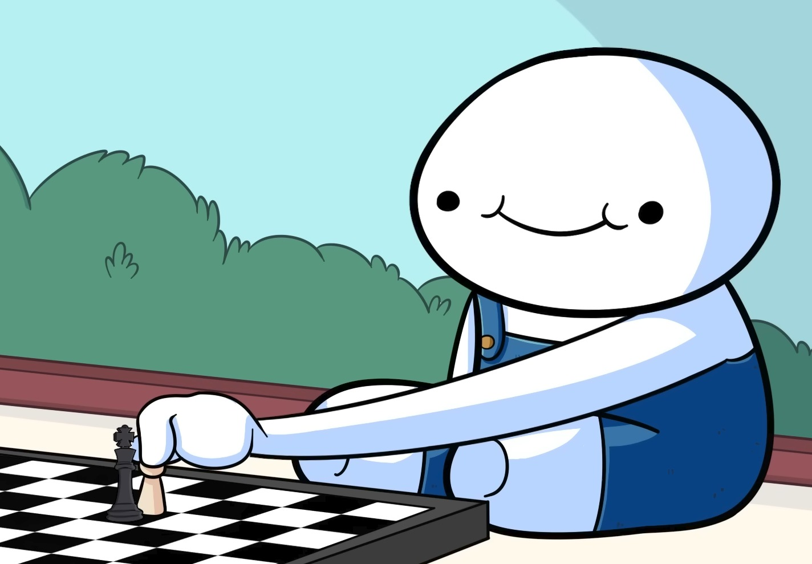

# ♟ CHESSKIDSDOTCOM

### A modern chess engine written in C++17

 

---

<table>
<tr>

<td align="center">

### I am the Chess Master.

</td>

<td align="center">

### Take THAT !!

</td>

<td align="center">

### “Amateurs.”

</td>

</tr>
</table>

---

# What is this?

`chesskidsdotcom` is a chess engine written from scratch in C++17.

The name comes from the website I used to play chess on growing up, so I kept it instead of giving it some serious engine name.

The project started because I wanted to understand how chess engines actually work internally.

Turns out chess engines and game engines in general are mostly:
- optimization
- recursion
- debugging
- move generation
- performance engineering

---

# Engine ( Brain ):
- bitboard move representation
- hybrid mailbox + bitboards
- packed 32-bit move encoding
- incremental make/unmake
- alpha-beta search
- transposition tables
- zobrist hashing
- move generation
- perft testing/debugging
- UCI communication
- modular engine structure

The engine can:
- understand chess positions
- generate legal moves
- search future positions
- evaluate positions
- and communicate with external chess GUIs.

---

### ♞ Play. Learn. Give up. Repeat.

### Built by C. Kumaran

